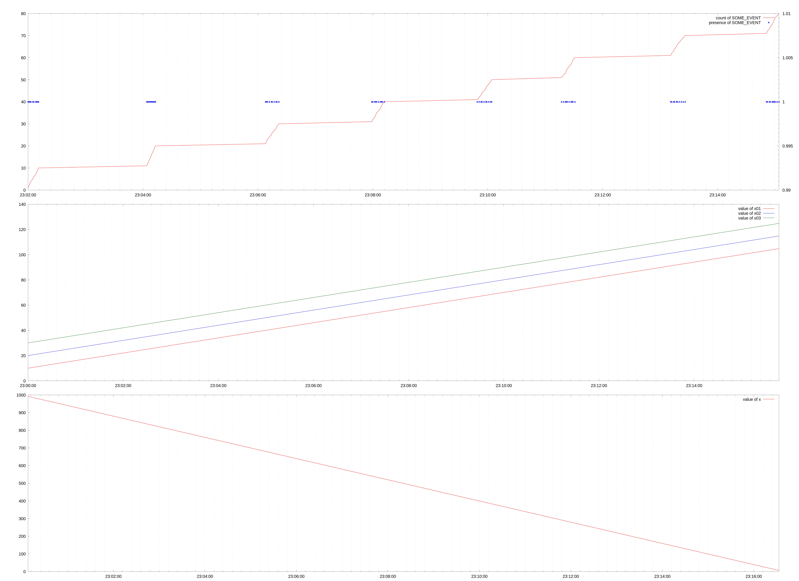

### Typical first call.

Some very basic usage. Just plot some value from the log:

<!-- docify::embed!("tests/cmd_tests.rs", cmd_simple) -->

### Adding more panels.

- timestamp format customized,
- some panels added

<!-- docify::embed!("tests/cmd_tests.rs", cmd_simple_panels) -->

### Using a toml graph config.

Draw a graph defined in [`demo lines`](some-playground/demo-lines.toml) TOML file.

<!-- docify::embed!("tests/cmd_tests.rs", cmd_demo_lines) -->

