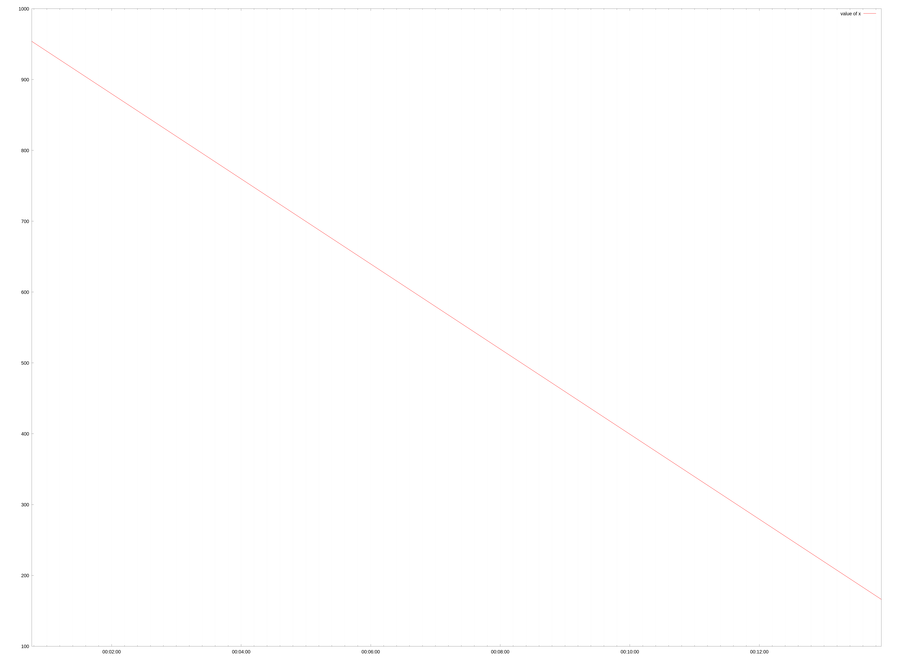
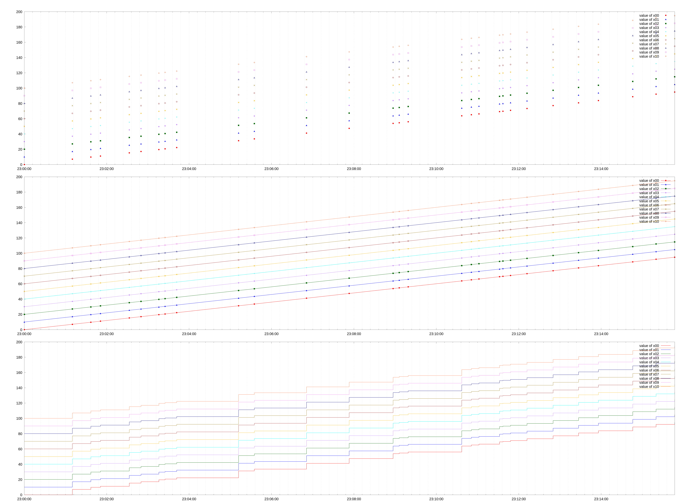

### Some command

Some very basic usage. Just plot some value from the graph

<!-- docify::embed!("tests/cmd_tests.rs", cmd_simple) -->

### Some command

Draw a graph defined in [`demo lines`](some-playground/demo.toml) TOML file.

<!-- docify::embed!("tests/cmd_tests.rs", cmd_demo_lines) -->

